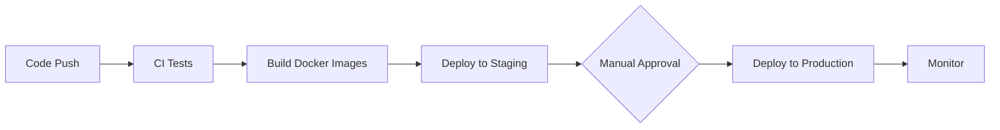

# Deployment & Operations

Complete guide to deploying and operating Clipper in production environments.

## Quick Links

- [[kubernetes|Kubernetes Deployment]] - Complete K8s deployment guide
- [[docker|Docker Deployment]] - Container-based deployment
- [[ci_cd|CI/CD Pipeline]] - Continuous integration and deployment
- [[infra|Infrastructure]] - Cloud infrastructure and architecture
- [[runbook|Operations Runbook]] - Day-to-day operational procedures

## Documentation Index

```dataview
TABLE title, summary, status, last_reviewed
FROM "docs/deployment"
WHERE file.name != "index"
SORT title ASC
```

## Getting Started

1. Start with [[kubernetes|Kubernetes Deployment]] for production-ready deployment
2. Or start with [[docker|Docker Deployment]] to understand our containerization strategy
3. Learn about [[ci_cd|CI/CD Pipeline]] for automated deployments
4. Review [[infra|Infrastructure]] for production architecture
5. Keep [[runbook|Operations Runbook]] handy for common tasks

## Deployment Workflow



## Key Documentation

### Deployment Guides

- [[kubernetes|Kubernetes Deployment]] - End-to-end production deployment
- [[docker|Docker Deployment]] - Multi-stage builds and containerization
- [[ci_cd|CI/CD Pipeline]] - GitHub Actions workflows
- [[infra|Infrastructure]] - Kubernetes, databases, and scaling

### Operational Procedures

- [[runbook|Operations Runbook]] - Common tasks and incident response
- [[../operations/monitoring|Monitoring]] - Observability and alerting
- [[../operations/migration|Migrations]] - Database migration procedures

### Security & Secrets

- [[../operations/secrets-management|Secrets Management]] - Secure credential handling
- [[../operations/security-scanning|Security Scanning]] - Automated security checks

---

**See also:** [[../index|Documentation Home]] · [[../operations/index|Operations]]

[[../index|← Back to Index]]
