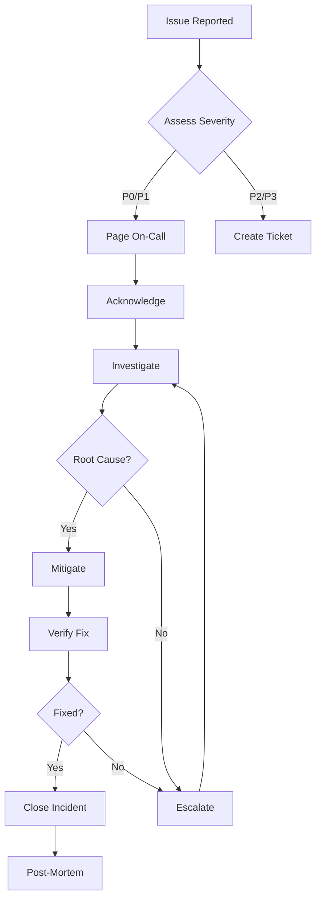

# Moderation Incidents and Common Issues

## Overview

This runbook provides incident response procedures and solutions to common moderation system issues. Use this as a first-response guide when issues are reported.

**Audience**: Operations team, support team, on-call engineers

**Prerequisites**:
- Access to monitoring dashboards
- Admin permissions
- Understanding of escalation procedures

## Table of Contents

- [Incident Response Framework](#incident-response-framework)
- [Security Incidents](#security-incidents)
  - [Unauthorized Access](#unauthorized-access)
  - [Mass Ban Attack](#mass-ban-attack)
  - [Moderator Account Compromise](#moderator-account-compromise)
- [Common Issues and Solutions](#common-issues-and-solutions)
  - [User Can't Submit Content](#user-cant-submit-content)
  - [Moderator Can't Ban User](#moderator-cant-ban-user)
  - [Ban Not Syncing to Twitch](#ban-not-syncing-to-twitch)
  - [Audit Logs Not Appearing](#audit-logs-not-appearing)
  - [Performance Degradation](#performance-degradation)
- [Contact Procedures](#contact-procedures)
- [Post-Incident Review](#post-incident-review)
- [Related Runbooks](#related-runbooks)

---

## Incident Response Framework

### Incident Severity Levels

| Level | Description | Response Time | Examples |
|-------|-------------|---------------|----------|
| **P0** | Critical impact, service down | < 5 min | API outage, security breach |
| **P1** | Major impact, degraded service | < 15 min | High error rate, data loss |
| **P2** | Minor impact, workaround available | < 1 hour | Single feature broken |
| **P3** | Minimal impact, cosmetic issues | < 4 hours | UI glitch, typos |

### Response Workflow



### Initial Response Checklist

- [ ] Acknowledge incident
- [ ] Assess severity and impact
- [ ] Check monitoring dashboards
- [ ] Review recent changes
- [ ] Gather initial data
- [ ] Notify stakeholders
- [ ] Create incident ticket

---

## Security Incidents

### Unauthorized Access

#### Symptoms

- Permission denied errors in logs
- Failed authentication attempts
- Unusual API access patterns
- Reports of unauthorized moderation actions

#### Investigation Steps

```bash
# 1. Check recent failed auth attempts
curl -s -H "Authorization: Bearer $API_TOKEN" \
  "https://api.clpr.tv/api/v1/moderation/audit-logs?action=auth_failed&limit=100" | \
  jq '.logs[] | {time: .created_at, user: .actor_username, ip: .ip_address}'

# 2. Check recent permission denials
curl -s -H "Authorization: Bearer $API_TOKEN" \
  "https://api.clpr.tv/api/v1/moderation/audit-logs?action=permission_denied&limit=100" | \
  jq '.logs[] | {time: .created_at, user: .actor_username, action_attempted: .details.action}'

# 3. Identify suspicious IPs
curl -s -H "Authorization: Bearer $API_TOKEN" \
  "https://api.clpr.tv/api/v1/moderation/audit-logs?start_time=$(date -u -d '24 hours ago' '+%Y-%m-%dT%H:%M:%SZ')&limit=5000" | \
  jq -r '.logs[] | .ip_address' | sort | uniq -c | sort -rn | head -20
```

#### Immediate Actions

1. **Block suspicious IPs**
   ```bash
   SUSPICIOUS_IP="192.168.1.100"
   
   # Add to firewall
   sudo iptables -A INPUT -s $SUSPICIOUS_IP -j DROP
   
   # Or block at application level
   curl -X POST -H "Authorization: Bearer $API_TOKEN" \
     "https://api.clpr.tv/api/v1/admin/firewall/block" \
     -d '{"ip": "'$SUSPICIOUS_IP'", "reason": "Suspicious activity", "duration": 86400}'
   ```

2. **Force password reset for affected accounts**
   ```bash
   # Get affected users
   AFFECTED_USERS=$(curl -s -H "Authorization: Bearer $API_TOKEN" \
     "https://api.clpr.tv/api/v1/moderation/audit-logs?ip_address=$SUSPICIOUS_IP" | \
     jq -r '.logs[] | .actor_id' | sort -u)
   
   # Force password reset
   for user_id in $AFFECTED_USERS; do
     curl -X POST -H "Authorization: Bearer $API_TOKEN" \
       "https://api.clpr.tv/api/v1/users/$user_id/force-password-reset" \
       -d '{"reason": "Security incident"}'
   done
   ```

3. **Enable MFA for all moderators**
   ```bash
   curl -X POST -H "Authorization: Bearer $API_TOKEN" \
     "https://api.clpr.tv/api/v1/admin/security/require-mfa" \
     -d '{"role": "moderator", "grace_period_hours": 24}'
   ```

4. **Notify security team**
   ```bash
   # Send alert
   curl -X POST "https://api.clpr.tv/api/v1/notifications/security" \
     -d '{
       "severity": "high",
       "title": "Unauthorized Access Detected",
       "description": "Suspicious activity from IP: '$SUSPICIOUS_IP'",
       "affected_users": '$AFFECTED_USERS'
     }'
   ```

---

### Mass Ban Attack

#### Symptoms

- Large number of bans created in short time
- Reports of legitimate users being banned
- Ban creation rate spike in metrics

#### Detection

```bash
# Check ban creation rate
curl -s -H "Authorization: Bearer $API_TOKEN" \
  "https://api.clpr.tv/api/v1/moderation/audit-logs?action=ban_user&start_time=$(date -u -d '1 hour ago' '+%Y-%m-%dT%H:%M:%SZ')&limit=1000" | \
  jq '.logs | length'
# If > 100, investigate further

# Identify actor creating bans
curl -s -H "Authorization: Bearer $API_TOKEN" \
  "https://api.clpr.tv/api/v1/moderation/audit-logs?action=ban_user&start_time=$(date -u -d '1 hour ago' '+%Y-%m-%dT%H:%M:%SZ')&limit=1000" | \
  jq '.logs | group_by(.actor_id) | .[] | {actor: .[0].actor_username, count: length}' | \
  jq -s 'sort_by(.count) | reverse'
```

#### Response

1. **Suspend compromised moderator**
   ```bash
   COMPROMISED_MOD_ID="user-abc123"
   
   # Revoke all moderator permissions
   curl -X DELETE -H "Authorization: Bearer $API_TOKEN" \
     "https://api.clpr.tv/api/v1/moderation/moderators?user_id=$COMPROMISED_MOD_ID"
   
   # Suspend account
   curl -X POST -H "Authorization: Bearer $API_TOKEN" \
     "https://api.clpr.tv/api/v1/users/$COMPROMISED_MOD_ID/suspend" \
     -d '{"reason": "Account compromise - mass ban attack"}'
   ```

2. **Revert malicious bans**
   ```bash
   # Get ban IDs from compromised moderator in last hour
   START_TIME=$(date -u -d '1 hour ago' '+%Y-%m-%dT%H:%M:%SZ')
   
   curl -s -H "Authorization: Bearer $API_TOKEN" \
     "https://api.clpr.tv/api/v1/moderation/audit-logs?action=ban_user&actor_id=$COMPROMISED_MOD_ID&start_time=$START_TIME" | \
     jq -r '.logs[] | .details.ban_id' > /tmp/malicious_bans.txt
   
   # Revert bans
   while IFS= read -r ban_id; do
     echo "Revoking ban: $ban_id"
     curl -X DELETE -H "Authorization: Bearer $API_TOKEN" \
       "https://api.clpr.tv/api/v1/moderation/bans/$ban_id"
     sleep 0.2
   done < /tmp/malicious_bans.txt
   ```

3. **Notify affected users**
   ```bash
   # Get list of affected users
   curl -s -H "Authorization: Bearer $API_TOKEN" \
     "https://api.clpr.tv/api/v1/moderation/audit-logs?action=ban_user&actor_id=$COMPROMISED_MOD_ID&start_time=$START_TIME" | \
     jq -r '.logs[] | .resource_id' > /tmp/affected_users.txt
   
   # Send notification
   while IFS= read -r user_id; do
     curl -X POST -H "Authorization: Bearer $API_TOKEN" \
       "https://api.clpr.tv/api/v1/notifications/send" \
       -d '{
         "user_id": "'$user_id'",
         "type": "ban_revoked",
         "message": "Your ban has been revoked. This was due to a security incident. We apologize for the inconvenience."
       }'
   done < /tmp/affected_users.txt
   ```

---

### Moderator Account Compromise

#### Symptoms

- Moderator reports unusual activity
- Actions they didn't perform appear in logs
- Login from unexpected location
- Password reset requests they didn't initiate

#### Immediate Actions

1. **Suspend moderator account** (see [Emergency Revoke Moderator](./moderation-operations.md#emergency-revoke-moderator))

2. **Review all recent actions**
   ```bash
   SUSPECT_MOD_ID="user-xyz789"
   
   # Get all actions in last 7 days
   ./user-action-history.sh $SUSPECT_MOD_ID > investigation-report.txt
   
   # Review for suspicious patterns
   grep -E "ban_user|remove_moderator|update_permissions" investigation-report.txt
   ```

3. **Contact moderator directly**
   - Verify identity through out-of-band channel
   - Confirm they didn't perform suspicious actions
   - Guide through password reset
   - Enable MFA on account

4. **Revert unauthorized actions**
   ```bash
   # If specific actions need reverting, use timestamps
   START_TIME="2026-02-03T10:00:00Z"
   END_TIME="2026-02-03T11:00:00Z"
   
   # Get actions in compromised window
   curl -s -H "Authorization: Bearer $API_TOKEN" \
     "https://api.clpr.tv/api/v1/moderation/audit-logs?actor_id=$SUSPECT_MOD_ID&start_time=$START_TIME&end_time=$END_TIME" | \
     jq '.logs[] | {action, resource_id, details}'
   ```

---

## Common Issues and Solutions

### User Can't Submit Content

#### Symptoms

- User reports "You are banned" error
- Submit button disabled
- 403 Forbidden error on submission

#### Diagnosis

```bash
#!/bin/bash
# diagnose-user-ban.sh

USERNAME="${1:-}"
if [ -z "$USERNAME" ]; then
  echo "Usage: $0 <username>"
  exit 1
fi

echo "Diagnosing ban status for: $USERNAME"
echo "====================================="
echo

# Get user ID
USER_ID=$(curl -s -H "Authorization: Bearer $API_TOKEN" \
  "https://api.clpr.tv/api/v1/users/by-username/$USERNAME" | jq -r '.id')

echo "User ID: $USER_ID"
echo

# Check ban status
BAN_INFO=$(curl -s -H "Authorization: Bearer $API_TOKEN" \
  "https://api.clpr.tv/api/v1/moderation/bans?user_id=$USER_ID")

echo "Ban Status:"
echo "$BAN_INFO" | jq '{
  is_banned: (.bans | length > 0),
  active_bans: .bans[] | {
    id, 
    reason, 
    created_at, 
    expires_at,
    is_permanent,
    channel_id
  }
}'
```

#### Solutions

**If ban is legitimate:**
- Explain ban reason to user
- Direct to appeal process if available

**If ban is error:**
```bash
# Revoke incorrect ban
BAN_ID="ban-abc123"
curl -X DELETE -H "Authorization: Bearer $API_TOKEN" \
  "https://api.clpr.tv/api/v1/moderation/bans/$BAN_ID" \
  -d '{"reason": "Ban issued in error"}'
```

**If ban expired but not cleared:**
```bash
# Clean up expired bans
curl -X POST -H "Authorization: Bearer $API_TOKEN" \
  "https://api.clpr.tv/api/v1/moderation/bans/cleanup-expired" \
  -d '{"user_id": "'$USER_ID'"}'
```

---

### Moderator Can't Ban User

#### Symptoms

- "Permission denied" error
- Ban button grayed out
- 403 Forbidden on ban API call

#### Diagnosis

```bash
# Check moderator permissions
MOD_USERNAME="moderator_name"
MOD_ID=$(curl -s -H "Authorization: Bearer $API_TOKEN" \
  "https://api.clpr.tv/api/v1/users/by-username/$MOD_USERNAME" | jq -r '.id')

# Get moderator info
curl -s -H "Authorization: Bearer $API_TOKEN" \
  "https://api.clpr.tv/api/v1/moderation/moderators?user_id=$MOD_ID" | \
  jq '.moderators[] | {
    channel_id,
    scope,
    permissions,
    expires_at
  }'
```

#### Solutions

**Missing permission:**
```bash
# Grant ban_users permission
MODERATOR_ID="mod-xyz789"
curl -X PATCH -H "Authorization: Bearer $API_TOKEN" \
  "https://api.clpr.tv/api/v1/moderation/moderators/$MODERATOR_ID" \
  -d '{"permissions": ["ban_users", "moderate_content", "view_audit_logs"]}'
```

**Expired access:**
```bash
# Extend moderator access
curl -X PATCH -H "Authorization: Bearer $API_TOKEN" \
  "https://api.clpr.tv/api/v1/moderation/moderators/$MODERATOR_ID" \
  -d '{"expires_at": "'$(date -u -d '+30 days' '+%Y-%m-%dT%H:%M:%SZ')'"}'
```

**Wrong channel scope:**
```bash
# Add moderator to correct channel
CHANNEL_ID="channel-abc123"
curl -X POST -H "Authorization: Bearer $API_TOKEN" \
  "https://api.clpr.tv/api/v1/moderation/moderators" \
  -d '{
    "user_id": "'$MOD_ID'",
    "channel_id": "'$CHANNEL_ID'",
    "permissions": ["ban_users", "moderate_content"],
    "scope": "community"
  }'
```

---

### Ban Not Syncing to Twitch

#### Symptoms

- User banned on Clipper but not on Twitch
- "Sync failed" error message
- Twitch shows user as not banned

#### Diagnosis

See [Ban Sync Troubleshooting](./ban-sync-troubleshooting.md) runbook for detailed procedures.

Quick check:
```bash
# Check sync status
BROADCASTER_ID="123456789"
curl -s -H "Authorization: Bearer $API_TOKEN" \
  "https://api.clpr.tv/api/v1/moderation/audit-logs?action=sync_bans&channel_id=$BROADCASTER_ID&limit=5" | \
  jq '.logs[] | {time: .created_at, status: .details.status, error: .details.error}'
```

#### Quick Fixes

**OAuth scope issue:**
```bash
# User must re-authenticate with correct scopes
echo "Direct user to: https://api.clpr.tv/api/v1/auth/twitch?scope=moderator:manage:banned_users"
```

**Rate limit:**
```bash
# Wait and retry
sleep 60
curl -X POST -H "Authorization: Bearer $API_TOKEN" \
  "https://api.clpr.tv/api/v1/moderation/sync-bans" \
  -d '{"broadcaster_id": "'$BROADCASTER_ID'"}'
```

---

### Audit Logs Not Appearing

#### Symptoms

- No recent logs in audit log viewer
- API returns empty results
- Compliance reports missing data

#### Diagnosis

```bash
# Check if logs are being written
curl -s -H "Authorization: Bearer $API_TOKEN" \
  "https://api.clpr.tv/api/v1/moderation/audit-logs?limit=1" | jq '.logs[0].created_at'

# Compare to current time
LAST_LOG=$(curl -s -H "Authorization: Bearer $API_TOKEN" \
  "https://api.clpr.tv/api/v1/moderation/audit-logs?limit=1" | jq -r '.logs[0].created_at')
  
echo "Last log: $LAST_LOG"
echo "Current time: $(date -u '+%Y-%m-%dT%H:%M:%SZ')"

# Check database connection
psql -h production-db.clpr.tv -U clipper_admin -d clipper_prod \
  -c "SELECT COUNT(*), MAX(created_at) FROM audit_logs WHERE created_at > NOW() - INTERVAL '1 hour';"
```

#### Solutions

**Audit logging disabled:**
```bash
# Re-enable audit logging
curl -X PATCH -H "Authorization: Bearer $API_TOKEN" \
  "https://api.clpr.tv/api/v1/admin/features/audit_logging" \
  -d '{"enabled": true}'
```

**Database connection issue:**
```bash
# Restart backend service
sudo systemctl restart clipper-backend

# Or in Kubernetes
kubectl rollout restart deployment/clipper-backend -n production
```

**Queue backlog:**
```bash
# Check queue depth
redis-cli -h redis.clpr.tv LLEN audit_log_queue

# If > 10000, increase workers or clear old entries
redis-cli -h redis.clpr.tv LTRIM audit_log_queue 0 1000
```

---

### Performance Degradation

#### Symptoms

- Slow API responses (> 2 seconds)
- Timeout errors
- High CPU or memory usage
- Database connection pool exhausted

#### Diagnosis

```bash
# Check current latency
START=$(date +%s%N)
curl -s -H "Authorization: Bearer $API_TOKEN" \
  "https://api.clpr.tv/api/v1/moderation/bans?limit=10" > /dev/null
END=$(date +%s%N)
echo "Latency: $(( (END - START) / 1000000 ))ms"

# Check database connections
psql -h production-db.clpr.tv -U clipper_admin -d clipper_prod \
  -c "SELECT COUNT(*), state FROM pg_stat_activity WHERE datname = 'clipper_prod' GROUP BY state;"

# Check cache hit rate
redis-cli -h redis.clpr.tv INFO stats | grep keyspace_hits
```

#### Solutions

**Database connection pool full:**
```bash
# Kill idle connections
psql -h production-db.clpr.tv -U clipper_admin -d clipper_prod << SQL
SELECT pg_terminate_backend(pid) 
FROM pg_stat_activity 
WHERE state = 'idle' 
  AND state_change < NOW() - INTERVAL '5 minutes'
  AND datname = 'clipper_prod';
SQL
```

**Cache invalidation storm:**
```bash
# Temporarily increase cache TTL
curl -X PATCH -H "Authorization: Bearer $API_TOKEN" \
  "https://api.clpr.tv/api/v1/admin/settings/cache_ttl" \
  -d '{"ban_list_ttl": 300, "moderator_list_ttl": 600}'
```

**Query optimization needed:**
```bash
# Check slow queries
psql -h production-db.clpr.tv -U clipper_admin -d clipper_prod \
  -c "SELECT query, calls, mean_exec_time, max_exec_time 
      FROM pg_stat_statements 
      WHERE query LIKE '%bans%' OR query LIKE '%moderators%'
      ORDER BY mean_exec_time DESC LIMIT 10;"
```

---

## Contact Procedures

### Escalation Path

```
Level 1: On-Call Engineer
  ↓ (15 min, unresolved)
Level 2: Engineering Manager
  ↓ (30 min, unresolved)
Level 3: VP Engineering / CTO
  ↓ (1 hour, critical only)
Level 4: CEO
```

### Contact Information

| Role | Contact Method | Response Time |
|------|---------------|---------------|
| **On-Call Engineer** | PagerDuty alert | < 5 min |
| **Operations Team** | Slack: #ops-team | < 15 min |
| **Security Team** | security@clpr.tv | < 30 min |
| **Engineering Manager** | Phone: (555) 123-4567 | < 30 min |
| **VP Engineering** | Phone: (555) 234-5678 | < 1 hour |

### Security-Specific Contacts

| Issue Type | Contact | Method |
|------------|---------|--------|
| **Data Breach** | security@clpr.tv | Email + PagerDuty |
| **Account Compromise** | security@clpr.tv | Email |
| **Vulnerability** | security@clpr.tv | Email (encrypted) |
| **Legal/Compliance** | legal@clpr.tv | Email |

### External Contacts

- **Twitch Developer Support**: https://dev.twitch.tv/support
- **AWS Support**: Premium support hotline
- **Database Vendor**: 24/7 support line

---

## Post-Incident Review

### Post-Mortem Template

```markdown
# Incident Post-Mortem

**Incident ID**: INC-2026-001
**Date**: 2026-02-03
**Severity**: P1
**Duration**: 45 minutes

## Summary
Brief description of what happened

## Timeline
- 10:00 UTC: Issue detected
- 10:05 UTC: On-call engineer paged
- 10:10 UTC: Root cause identified
- 10:30 UTC: Mitigation applied
- 10:45 UTC: Service restored

## Impact
- Users affected: 500
- Revenue impact: $X
- Downtime: 45 minutes

## Root Cause
Detailed explanation of what caused the issue

## Detection
How the issue was discovered

## Resolution
Steps taken to resolve

## Prevention
- Action item 1: [Owner] by [Date]
- Action item 2: [Owner] by [Date]

## Lessons Learned
- What went well
- What could be improved
```

### Follow-Up Actions

Within 24 hours:
- [ ] Document incident in post-mortem
- [ ] Identify action items
- [ ] Assign owners and due dates
- [ ] Update runbooks if needed

Within 1 week:
- [ ] Share post-mortem with team
- [ ] Implement quick wins
- [ ] Schedule follow-up review

Within 1 month:
- [ ] Complete all action items
- [ ] Update monitoring/alerts
- [ ] Conduct training if needed

---

## Related Runbooks

- [Moderation Operations](./moderation-operations.md) - Operational procedures
- [Ban Sync Troubleshooting](./ban-sync-troubleshooting.md) - Sync-specific issues
- [Permission Escalation](./permission-escalation.md) - Access control
- [Moderation Rollback](./moderation-rollback.md) - Emergency procedures
- [Moderation Monitoring](./moderation-monitoring.md) - Monitoring and alerts
- [Audit Log Operations](./audit-log-operations.md) - Log review

---

**Last Updated**: 2026-02-03  
**Document Owner**: Operations Team  
**Review Frequency**: Quarterly

**Emergency Contact**: ops-oncall@clpr.tv (PagerDuty)
